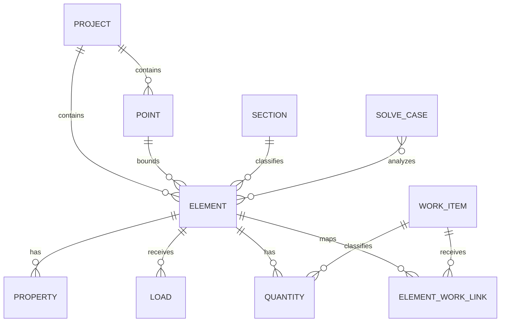

# Canonical frontend data model

## Design intent

The application models a small normalized relational system in static
JavaScript. A fact has one canonical home and views join records by stable IDs.
This reduces contradictory copies while keeping the repository usable without a
backend.



The Mermaid diagram is documentation only. The website renders its graph from
the data collections.

## Collections

| Collection | Primary ID example | Purpose | Important references |
|---|---|---|---|
| `projects` | `PROJECT_SAMPLE_MDM_001` | Root study/project context | — |
| `levels` | `LEVEL_DEMO_1` | Analytical or viewer datum | `projectId` |
| `grids` | `GRID_VIEWER_1` | Viewer grid convention | `projectId` |
| `points` | `POINT_B` | One canonical XYZ coordinate | `projectId` |
| `sections` | `SECTION_BEAM_230_450` | Shared shape and dimensions | — |
| `elements` | `BEAM_AB` | Identity and connectivity | `projectId`, `startPointId`, `endPointId`, `sectionId` |
| `elementProperties` | `PROPERTY_EI_AB` | Structural properties | `elementId` |
| `loads` | `LOAD_AB_UDL` | Element loading | `elementId` |
| `solveCases` | `SOLVE_MDM_001` | Method, members and end conditions | `memberIds` |
| `quantities` | `QTY_CONCRETE_AB` | Quantity definition | `elementId`, `workItemId` |
| `workItems` | `WORK_CONCRETE` | Construction or document classification | — |
| `elementWorkLinks` | `LINK_AB_CONCRETE` | Many-to-many mapping | `elementId`, `workItemId` |
| `methodTemplates` | `METHOD_RCC_BEAM` | Source-backed work method | `linkedWorkItemId` |
| `specificationTemplates` | `SPEC_RCC_BEAM` | Source-backed clauses | `linkedWorkItemId` |
| `viewConsumers` | `VIEW_ENGINEERING` | Field-level lineage metadata | `consumes[]` |
| `graphNodes` | `BEAM_AB` | Presentation metadata for a canonical entity | canonical ID where applicable |
| `relationships` | `REL_AB_LOAD` | Typed graph edges | `source`, `target`, `type` |

## Evidence-bearing value

Important numerical fields use a value object:

```js
{
  value: 6,
  unit: "m",
  status: "verified",
  sourceId: "SRC_SHARED_DIMENSIONS",
  note: null
}
```

`status` is not decorative UI text. Renderers use it to distinguish:

- `verified`
- `derived_verified`
- `illustrative`
- `linked_only`
- `unknown`

Provenance descriptions are centralized in `data/provenance.js`; no private
local source paths are exposed.

## Runtime joins and derivations

`js/data-access.js` joins references into runtime elements:

1. Resolve start and end points.
2. Compute 3D length from coordinates.
3. Resolve the section, EI property and load.
4. Solve the controlled two-span MDM case.
5. Calculate concrete volume as `L × b × D`.
6. Return the same runtime records to every view.

The sandbox never mutates the frozen canonical model. It creates a runtime copy
where Point B moves to the selected AB length and Point C shifts by the same
amount, preserving the verified 6 m BC length. All downstream results then
recompute from that copy.

## Selection and view state

`js/store.js` owns:

```text
selectedEntityId
activeElementId
graph.mode / depth / category / search
viewer.mode / layers / levelHeight / camera
sandbox.enabled / lengthAB
```

Render modules subscribe to this one store. Selecting `BEAM_BC` in the graph or
any data-generated element control therefore changes every consumer without
module-to-module coupling.

## Integrity rules

`js/integrity.js` checks:

- uniqueness inside canonical, graph-node and relationship ID namespaces;
- element point and section references;
- property, load, quantity and work-link references;
- graph relationship endpoints;
- the verified engineering and quantity baseline;
- joint equilibrium;
- source step/count invariants.

Run `node tests/model-integrity.test.cjs` after editing data. Add a new
collection to the canonical ID and reference checks when extending the schema.

## Extending the model

To add an element:

1. Add its points if they do not already exist.
2. Add one `elements` record with stable references.
3. Link rather than copy the section, load, property and work items.
4. Add graph presentation metadata and typed relationships.
5. Attach sources/statuses to important facts.
6. Run both repository tests.

Columns, slabs and storeys can be introduced as new element types. Production
use would move these same entities and constraints to an actual relational
database, add migrations, and enforce foreign keys at write time.

